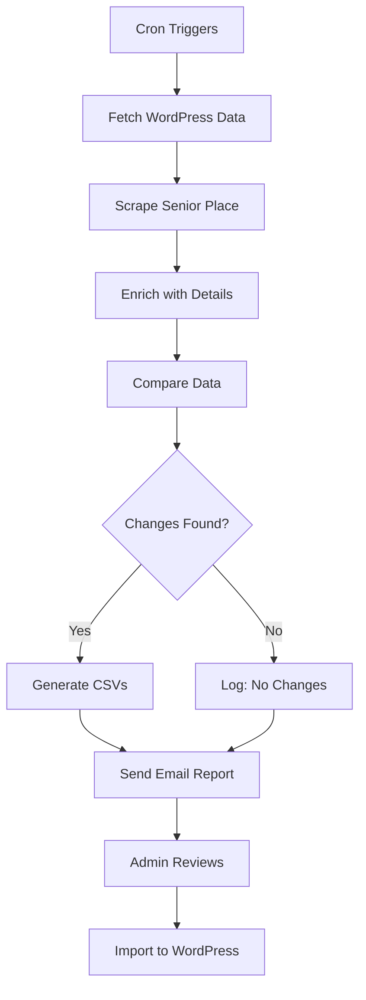

# Monthly Update System

Automated system to update senior living listings every 30 days with new data from Senior Place and Seniorly.

## 🎯 What It Does

1. **Discovers New Listings** - Finds listings added to Senior Place/Seniorly that aren't on your WordPress site
2. **Updates Existing Listings** - Updates pricing, care types, descriptions, and images for existing listings
3. **Generates Import Files** - Creates WordPress All Import-ready CSV files
4. **Sends Email Reports** - Notifies you when updates are ready

## 📋 Quick Start

### 1. Initial Setup

```bash
# Install dependencies
pip3 install playwright requests aiohttp

# Install Playwright browsers
python3 -m playwright install chromium

# Setup scheduler
chmod +x setup_monthly_scheduler.sh
./setup_monthly_scheduler.sh
```

### 2. Configure Environment Variables

Add to your `~/.bashrc` or `~/.zshrc`:

```bash
# WordPress credentials
export WP_PASSWORD="your_wordpress_application_password"

# Senior Place credentials
export SP_PASSWORD="Hugomax2025!"

# Optional: Email notifications
export NOTIFICATION_EMAIL="your-email@example.com"
export SMTP_PASSWORD="your_gmail_app_password"
```

Then reload: `source ~/.bashrc` (or `source ~/.zshrc`)

### 3. Manual Test Run

```bash
python3 monthly_update_orchestrator.py \
    --full-update \
    --wp-password "$WP_PASSWORD" \
    --sp-password "$SP_PASSWORD"
```

### 4. Setup Automated Schedule

Install cron job (runs 1st of each month at 2am):

```bash
(crontab -l 2>/dev/null; echo "0 2 1 * * /Users/nicholas/Repos/senior-scrapr/run_monthly_update.sh") | crontab -
```

Alternative schedules:

- **Every 30 days**: `0 2 */30 * * /path/to/run_monthly_update.sh`
- **Every Sunday**: `0 3 * * 0 /path/to/run_monthly_update.sh`
- **15th of month**: `0 2 15 * * /path/to/run_monthly_update.sh`

## 📊 Output Files

Updates are saved in `monthly_updates/YYYYMMDD_HHMMSS/`:

```
monthly_updates/
└── 20251028_020000/
    ├── new_listings_20251028_020000.csv      # NEW listings to import
    ├── updated_listings_20251028_020000.csv   # EXISTING listings to update
    └── update_summary_20251028_020000.json    # Summary statistics
```

## 📥 WordPress Import

### Importing New Listings

1. Go to WordPress Admin → All Import → New Import
2. Upload `new_listings_[timestamp].csv`
3. Select Post Type: **Listing**
4. Map fields:
   - `title` → Post Title
   - `senior_place_url` → ACF: URL
   - `featured_image` → Featured Image (Download from URL)
   - `price` → ACF: Price
   - `normalized_types` → Taxonomy: Type (comma-separated, existing terms only)
   - `address`, `city`, `state`, `zip` → ACF fields
5. Enable "Only assign existing taxonomy terms"
6. Run import

### Updating Existing Listings

1. Go to WordPress Admin → All Import → New Import
2. Upload `updated_listings_[timestamp].csv`
3. Select Post Type: **Listing**
4. **Important**: Set "Unique Identifier" to `ID`
5. Map only fields to update:
   - `price` → ACF: Price
   - `normalized_types` → Taxonomy: Type
6. Enable "Update existing records"
7. Run import

## 📧 Email Notifications

### Setup Gmail Notifications

1. Create Gmail App Password:

   - Go to Google Account → Security
   - Enable 2-Step Verification
   - Create App Password for "Mail"
   - Save the 16-character password

2. Configure environment:

```bash
export NOTIFICATION_EMAIL="your-email@gmail.com"
export SMTP_PASSWORD="your_app_password"
```

3. Send test report:

```bash
python3 send_monthly_report.py \
    --to "your-email@gmail.com" \
    --from "your-email@gmail.com" \
    --smtp-password "$SMTP_PASSWORD"
```

### Email Report Contents

The HTML email includes:

- 📊 Statistics (new listings, updates, pricing changes)
- ⚠️ Action items (imports needed)
- 📁 File locations
- ✅ Success confirmation

## 🔍 Monitoring

### Check Cron Logs

```bash
# View latest log
ls -lt monthly_updates/logs/ | head -5
tail -f monthly_updates/logs/update_YYYYMMDD_HHMMSS.log
```

### Check Cron Job Status

```bash
# List installed cron jobs
crontab -l

# Check if cron is running (macOS)
sudo launchctl list | grep cron

# Check if cron is running (Linux)
systemctl status cron
```

### Manual Trigger

```bash
# Run manually (doesn't wait for scheduled time)
./run_monthly_update.sh
```

## 🛠️ Troubleshooting

### Issue: Cron job not running

**macOS**: Grant Full Disk Access to cron

1. System Preferences → Security & Privacy → Privacy
2. Select "Full Disk Access"
3. Add `/usr/sbin/cron`

**Linux**: Check cron service

```bash
sudo systemctl status cron
sudo systemctl start cron
```

### Issue: Environment variables not found

Cron doesn't load your shell profile. Either:

1. **Option A**: Add variables to crontab directly:

```bash
crontab -e
# Add these lines:
WP_PASSWORD=your_password
SP_PASSWORD=your_seniorplace_password
0 2 1 * * /path/to/run_monthly_update.sh
```

2. **Option B**: Source profile in script:
   Edit `run_monthly_update.sh` and add at top:

```bash
source ~/.bashrc  # or ~/.zshrc
```

### Issue: WordPress API returns 401 Unauthorized

1. Verify application password is correct
2. Check WordPress user has proper permissions
3. Test API access:

```bash
curl -u "nicholas_editor:YOUR_APP_PASSWORD" \
  "https://aplaceforseniorscms.kinsta.cloud/wp-json/wp/v2/listing?per_page=1"
```

### Issue: Senior Place login fails

1. Verify credentials in environment variables
2. Ensure your Senior Place password is set in environment
3. Test login manually at https://app.seniorplace.com/login

## 📈 States Covered

Default configuration processes these states:

- Arizona (AZ)
- California (CA)
- Colorado (CO)
- Utah (UT)
- Idaho (ID)
- New Mexico (NM)

To change states:

```bash
python3 monthly_update_orchestrator.py \
    --full-update \
    --states AZ CA CO ID NM UT \
    --wp-password "$WP_PASSWORD"
```

## 🔄 Update Workflow



## 📚 Advanced Usage

### Run for specific states only

```bash
python3 monthly_update_orchestrator.py \
    --full-update \
    --states CA AZ \
    --wp-password "$WP_PASSWORD"
```

### Dry run (no WordPress changes)

Currently the script only generates CSVs - it doesn't modify WordPress directly. Manual import required.

### Generate report without running update

```bash
python3 send_monthly_report.py \
    --to "admin@example.com" \
    --from "updates@example.com" \
    --smtp-password "$SMTP_PASSWORD" \
    --summary-file "monthly_updates/20251028_020000/update_summary_20251028_020000.json"
```

## 🔐 Security Notes

- **Never commit passwords** to git
- Use environment variables or `.env` file (add to `.gitignore`)
- WordPress application passwords are safer than real passwords
- Rotate passwords regularly
- Use Gmail App Passwords, not your actual Gmail password

## 📞 Support

Questions? Issues?

1. Check logs: `monthly_updates/logs/`
2. Review summary: `monthly_updates/[timestamp]/update_summary_[timestamp].json`
3. Test components individually:
   - WordPress API: `curl -u "user:pass" "https://your-site/wp-json/wp/v2/listing"`
   - Senior Place scraper: `python3 scrapers_active/scrape_live_senior_place_data.py --limit 5`

## 🎉 You're All Set!

The system will now:

- ✅ Run automatically every month
- ✅ Find new listings
- ✅ Update existing data
- ✅ Email you reports
- ✅ Generate import-ready files

Just remember to import the CSVs into WordPress when you receive the notification!
